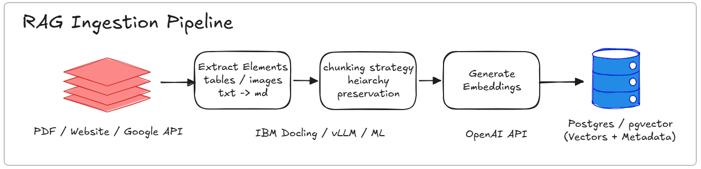

# Nanobot-CORE (Collaborative Open Retrieval Engine)

A comprehensive Python document processing and retrieval framework built for intelligent document ingestion, vector storage, and RAG (Retrieval-Augmented Generation) applications.

## Overview

Nanobot-CORE is a production-ready framework that leverages IBM Docling for advanced document processing, PostgreSQL with pgvector for vector storage, and integrates with LogFire for comprehensive observability. The framework provides flexible database configuration, multiple LLM provider support, and customizable metadata management for LLM responses grounded in truth.  

**Mission**: This framework was created to address the need for standardized knowledge management solutions in academic and research environments. Nanobot-CORE serves as an open-source foundation that nanofabrication facilities can adopt, customize, and contribute to, enabling:
- **Standardization**: Shared codebase and practices across facilities
- **Collaboration**: Common framework for knowledge sharing and integration
- **Education**: Teaching resource for implementing AI-powered knowledge management
- **Innovation**: Foundation for academic and business innovations using generative AI

By making advanced document processing and RAG capabilities accessible and standardized, Nanobot-CORE aims to accelerate the adoption of modern knowledge management techniques in research laboratories.

**Implementation**: Nanobot-CORE is built using fundamental Python with minimal abstractions. The pipeline is implemented directly in Python, with IBM Docling as the only external framework abstraction, ensuring transparency, maintainability, and full control over the document processing workflow.

## Key Features

### Document Processing
- **IBM Docling Integration**: Advanced document conversion that extracts:
  - **Images**: Page images and embedded pictures with configurable resolution
  - **Tables**: Structured table extraction and preservation
  - **Hierarchy**: Document structure, headings, and semantic organization
- **Multiple Chunking Strategies**: Configurable chunking approaches (default, balanced, fine-grained, paragraph-based)
- **Document Processor**: Complete pipeline for reading documents and populating the database

### Database & Vector Storage
- **PostgreSQL with pgvector**: High-performance vector similarity search
- **Flexible Database Configuration**: 
  - Switch between local PostgreSQL and external PostgreSQL (e.g., Neon)
  - Runtime database selection via configuration
  - Automatic database initialization and schema management
- **Customizable Metadata**: 
  - Extensible JSONB metadata schema
  - Metadata validation and querying capabilities
  - Support for custom metadata fields

### LLM Integration
- **Provider Flexibility**: Switch between different LLM providers and models
- **OpenAI Integration**: Embeddings and chat completions with automatic instrumentation
- **Configurable Models**: Per-operation model selection (embeddings, chat, etc.)

### Observability & Logging
- **LogFire Integration**: 
  - Automatic telemetry for LLM calls (embeddings, completions)
  - Pydantic LogFire integration for model tracking
  - Traces and spans for distributed observability
  - LLM call tracking and metrics
- **Dual Logging**: 
  - Local file logging (rotating logs, JSON format)
  - LogFire cloud logging for centralized observability
  - Configurable log levels and handlers

### User Interface
- **Streamlit Front-end**: Interactive chat interface for document Q&A
- **FastAPI Endpoints** (In Development): REST API for programmatic access

## Document Processing Pipeline



The complete document processing flow:

1. **Document Conversion**: IBM Docling converts PDFs/documents, extracting images, tables, and hierarchical structure
2. **Text Chunking**: Multiple strategies for splitting documents into semantic chunks
3. **Embedding Generation**: OpenAI (or configurable provider) generates vector embeddings
4. **Database Storage**: PostgreSQL with pgvector stores chunks, vectors, and metadata
5. **Vector Retrieval**: Similarity search retrieves relevant chunks
6. **RAG Integration**: LLM generates responses using retrieved context

## Project Structure


### Core Components

**app/** - Main application code
- **services/** - Service layer
  - `document_service.py` - Complete document processing pipeline
  - `chunking_service.py` - Document chunking strategies
  - `openai_service.py` - OpenAI API integration with LogFire
  - `prompt_loader.py` - Prompt template loading
- **database/** - Database operations
  - `setup.py` - Database initialization and schema creation
  - `common.py` - Connection management (local/external switching)
  - `insert.py` - Chunk insertion operations
  - `retrieval.py` - Vector similarity search
  - `transaction.py` - Transaction management
  - `maintenance.py` - Metadata updates and maintenance
- **models/** - Pydantic data models and validators
- **utils/** - Utility functions (file handling, tokenization, logging)
- **config/** - Configuration settings and logging setup
- **prompts/** - Prompt templates

**Main Scripts**:
- `nanobot.py` - Streamlit application with chat interface
- `document_processor.py` - CLI tool for processing documents

### Supporting Directories

- **data/** - Document storage (original and converted)
- **tests/** - Comprehensive test suite
- **examples/** - Example code and demonstrations
- **notebooks/** - Jupyter notebooks for development
- **sandbox/** - Experimental code
- **logs/** - Local log files

## Configuration

Configuration is managed through environment variables and `.env` files:

- **Database**: `LOCAL_DB_*`, `NEON_DB_*`, `USE_NEON`
- **OpenAI**: `OPENAI_*` (API key, models, tokens, etc.)
- **LogFire**: `LOGFIRE_TOKEN`
- **Vector Index**: `VECTOR_INDEX_*`
- **File Paths**: `FILE_PATHS_*`

## Usage

### Processing Documents

```bash
# Process a single file
python document_processor.py file.pdf

# Process with specific chunking strategy
python document_processor.py file.pdf --strategy balanced

# Process all files
python document_processor.py --all
```

### Running the Streamlit App

```bash
streamlit run nanobot.py
```

### Database Setup

The framework automatically initializes the database schema, enables pgvector extension, and creates necessary indexes. Database selection (local vs external) is controlled via the `USE_NEON` environment variable.

## Future Enhancements -- [In Progress]

- **FastAPI Endpoints**: Complete REST API implementation with async support
- **Event-Driven Architecture with Redis and Celery**:
  - **Redis**: 
    - Message broker for asynchronous Celery task queuing
    - Pub/sub channels for real-time event broadcasting to multiple clients
    - Session management and caching for multi-user support
    - Caching of embeddings and metadata to reduce database load
    - Stateless API design support through session storage
    - Horizontal scaling and load distribution
  - **Celery Workers**: 
    - Distributed background processing for document ingestion
    - Long-running operation support for document conversion and embedding generation
    - Scalable worker pools for parallel task execution
    - Task result tracking and monitoring
    - Error handling and retry mechanisms for failed tasks
- **Pydantic AI Integration**: 
  - Agent framework for autonomous document processing workflows
  - Agent managing agent frameworks for complex multi-agent orchestration
  - Structured AI workflows with type-safe agent interactions
- Additional LLM provider support
- Enhanced metadata customization UI
- Advanced analytics and reporting

## License

This project is licensed under the MIT License - see the [LICENSE](LICENSE) file for details.
